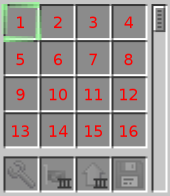
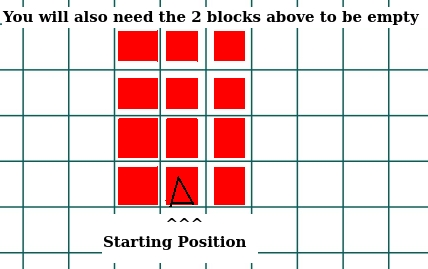

# Description
This folder contains a script to automate Ender Pearl Creation, located at `createEnderPearl.lua`.

You can make up to 34 ender pearls with it.
# Usage
* First, select the entire code.
* Then, paste it into the `edit` program from OpenComputers using the <kdb> Insert </kbd> key.
* Then, save the code using <kbd>Ctrl</kbd>+<kbd>S</kbd>
# Further Details
* For pragmatic reasons the robot does not resupply itself. It's up to you to do so.
* In order for the program to function properly you must necessarily you must place:
  + obsidian into slots from 1 to 14;
  + redstone blocks into slot 15;
  + redstone dust into slot 16;
* This picture shows the number of each slot: 
  * It has been acquired from https://ocdoc.cil.li/api:robot
* Make sure that you have a 3\*4\*3 space avaliable so that the robot can function properly.
* Do not go into said space while the robot is working.
* The image below should help (probably).
* 
